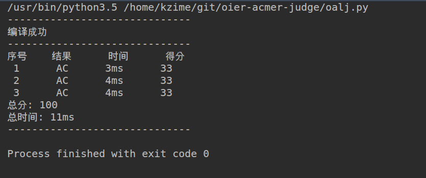

### OALJ (OIer and ACMer's Local Judge)

example of `config.txt`:

``` test
File Name: test.cpp
Input Name (example#.in): test#.in
Output Name (example#.out): test#.ans
#(1 2 3 4): 0 1 2         //上文#所代表的数字/字符串
max running time(1(s)): 1
max running memory(256(mb)): 256
```


#### 使用方法

##### 安装:

执行`install.py`安照引导进行安装,可能会需要`sudo`权限

##### 使用:

在你要评测的文件目录下执行`oalj` 生成`config.txt`模板, 然后进行填写

之后执行`oalj`


感受一下O(∩_∩)O~~



```
TODO LIST:
  -- 一键扒取大型oj上的测试数据并自动打包成data和config.txt
```
