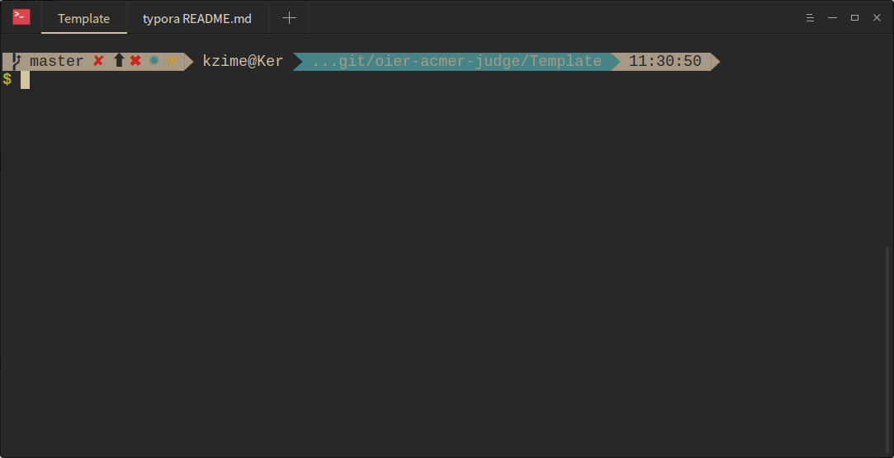
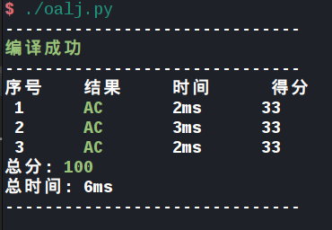

# OALJ (OIer and ACMer's Local Judge)

example of `config.txt`:

``` test
File Name: test.cpp
Input Name (example#.in): test#.in
Output Name (example#.out): test#.ans
#(1 2 3 4): 0 1 2         //上文#所代表的数字/字符串
max running time(1(s)): 1
max running memory(256(mb)): 256
```
## 功能

目前支持的功能：判断 `AC`，`WA`，`TLE`，`MLE`

正在开发的功能：显示内存占用   // $tan\frac{\pi}{2}$

---

***现在可以直接从COGS爬数据以及`config.txt`辣!!!!!!!!!!!!!***

***EXCITED!!***

## 使用方法

注意，暂时~~(未来八成也不会)~~不支持Windows系统.

### 安装:

执行`install.py`安照引导进行安装,**需要`sudo`权限.**

### 使用:

#### cogs[强推!!]

在需评测`cpp`文件目录下执行`cdc` 并输入题号来获取数据及`config.txt`

效果如图:



#### 非cogs

将数据放在data带评测文件目录内,并执行`oalj` 生成`config.txt`模板, 然后进行填写

之后执行`oalj`

感受一下O(∩_∩)O~~



```
TODO LIST:
  √- 一键扒取大型oj上的测试数据并自动打包成data和config.txt
  -- 显示内存占用
```
